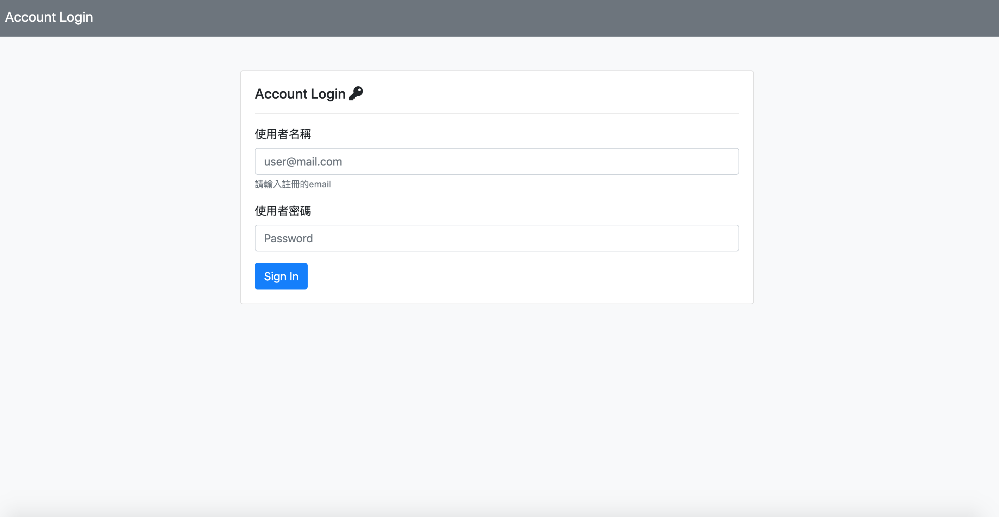
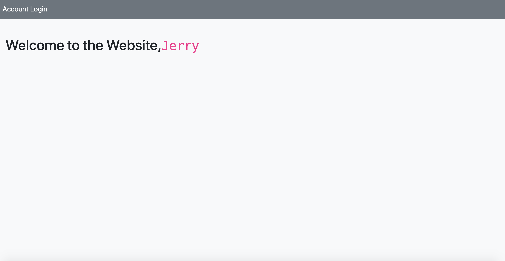
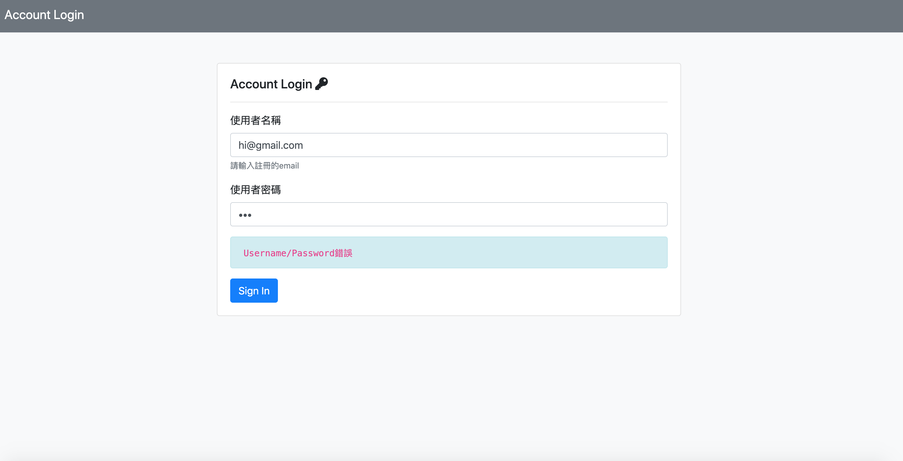

# 簡易登入頁面
練習用Express製作簡易登入頁面。

## Features
* 輸入使用者帳號及密碼
* 登入成功時顯示歡迎登入頁面
* 登入失敗時，提示"Username/Password錯誤"
* 以下為可成功登入測試用使用者

```

 {
  firstName: 'Vivion',
  email: 'vivion@stark.com',
  password: 'iamvivion'
 },
 {
  firstName: 'Alex',
  email: 'alex@hotmail.com',
  password: 'alexleader'
 },
 {
  firstName: 'Jerry',
  email: 'jerry@parker.com',
  password: 'iamjerry'
 },
 {
  firstName: 'Tim',
  email: 'tim@gamil.com',
  password: '*tim#@$!'
 },
 {
  irstName: 'Tom',
  email: 'tom@shield.com',
  password: 'tompassword'
 }
```

## Quick view

### 初始畫面


### 成功登入畫面


### 帳號或密碼輸入錯誤畫面



## Environment set up
* Node.js
* Express
* express-handlebars
* body-parser

## Installation

* clone this URL: https://github.com/chiehjerry/simple_login.git
* cd to the file
* instal npm
* you can visit this web on: http://localhost:3000
